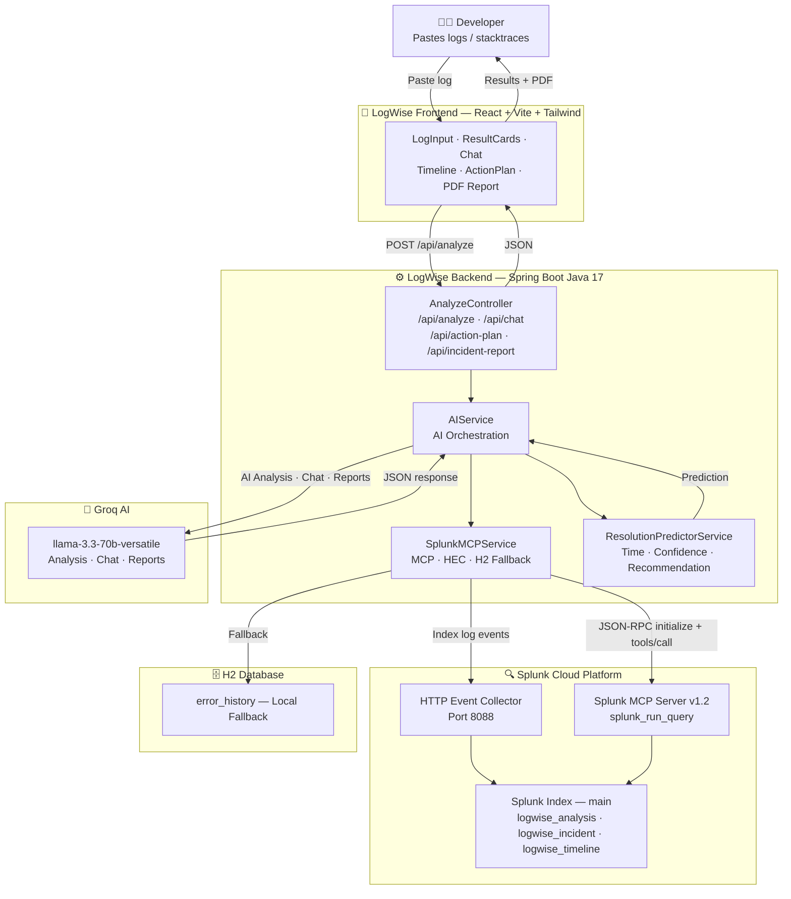

# LogWise AI 🔍

> **Intelligent Log Analysis powered by Splunk MCP + AI**

LogWise is an agentic DevOps assistant that transforms complex logs and stacktraces into actionable insights. It leverages **Splunk MCP Server** as the observability backbone and **Groq AI** for intelligent analysis.

Built for the **Splunk Agentic Ops Hackathon 2026**.

---

## 🏆 Hackathon Categories

- **Best Use of Splunk MCP Server** — Real-time querying of Splunk data via JSON-RPC MCP protocol
- **Best of Platform & Developer Experience** — 11 features designed for developers and DevOps teams
- **Most Valuable Feedback** — Structured incident analysis with actionable recommendations

---

## ✨ Features

| Feature | Description |
|---|---|
| 🔍 **AI Analysis** | Root cause, explanation, severity, suggested fixes |
| 🟣 **Splunk History** | Real occurrence count from Splunk Cloud via MCP |
| ⚡ **Resolution Predictor** | Estimated fix time + confidence score based on historical data |
| 🩷 **Similar Incidents** | Past incidents with real solutions from Splunk |
| 🟠 **Incident Replay Timeline** | Chronological event reconstruction from Splunk MCP |
| 🔷 **Impact Dashboard** | Affected service, severity, risks |
| 🟣 **Action Plan Generator** | AI-generated 5-step checklist with priorities |
| 🌹 **AI Incident Report** | Professional post-incident report with PDF export |
| 💬 **Chat With Incident** | Contextual Q&A about the specific incident |
| 🌙 **Dark / Light mode** | Full theme support |

---

## 🏗️ Architecture



---

## 🔌 How Splunk MCP is Used

LogWise uses the **Splunk MCP Server** (App ID: 7931) via JSON-RPC 2.0 for 3 distinct operations:

```
1. Error History    → splunk_run_query on sourcetype=logwise_analysis
                      Returns occurrences, first_seen, last_seen

2. Similar Incidents → splunk_run_query on sourcetype=logwise_incident
                       Returns past incidents with causes + solutions

3. Incident Timeline → splunk_run_query on sourcetype=logwise_timeline
                       Returns chronological events filtered by error_type
```

Each analysis also indexes the log into Splunk via **HEC (HTTP Event Collector)** for future historical reference.

---

## 🚀 Getting Started

### Prerequisites

- Java 17+
- Node.js 18+
- Splunk Cloud account (free trial at splunk.com)
- Groq API key (free at console.groq.com)

### Backend Setup

```bash
# 1. Clone the repository
git clone https://github.com/YOUR_USERNAME/logwise-ai.git
cd logwise-ai/logwise-backend

# 2. Configure credentials
cp src/main/resources/application.properties.example \
   src/main/resources/application.properties
# Edit application.properties with your keys

# 3. Run
mvn spring-boot:run
```

### Frontend Setup

```bash
cd logwise-frontend

# 1. Install dependencies
npm install

# 2. Run
npm run dev

# 3. Open http://localhost:3000
```

### Splunk Setup

1. Create a free Splunk Cloud Trial at [splunk.com](https://splunk.com)
2. Install **Splunk MCP Server** app (ID: 7931) from Splunkbase
3. Create a **HEC token** : Settings → Data Inputs → HTTP Event Collector
4. Create an **MCP encrypted token** from the Splunk MCP Server app
5. Fill in `application.properties` with your Splunk credentials

### Seed Demo Data (optional)

```bash
# Seed past incidents into Splunk
GET http://localhost:8080/api/seed-incidents

# Seed incident timelines
GET http://localhost:8080/api/seed-timeline-v3
```

---

## 🧪 Usage

1. Open `http://localhost:3000`
2. Paste any Java/Python/Node.js log, stacktrace or error message
3. Click **Analyze**
4. LogWise will:
    - Query Splunk MCP for historical context
    - Analyze with Groq AI
    - Display 11 structured result cards
    - Allow chat interaction with the incident

### Example Errors to Test

**NullPointerException:**
```
java.lang.NullPointerException: Cannot invoke "com.example.User.getEmail()"
  at com.example.NotificationService.sendEmail(NotificationService.java:87)
  at com.example.AuthorizationService.approve(AuthorizationService.java:134)
```

**OutOfMemoryError:**
```
java.lang.OutOfMemoryError: Java heap space
  at com.example.EmailTemplateService.renderTemplate(EmailTemplateService.java:142)
  at com.example.NotificationService.sendBulkEmails(NotificationService.java:87)
```

**Connection Timeout:**
```
org.springframework.dao.DataAccessResourceFailureException: Unable to acquire JDBC Connection
  Caused by: com.zaxxer.hikari.pool.HikariPool$PoolInitializationException
  Caused by: org.postgresql.util.PSQLException: Connection refused. localhost:5432
```

---

## 🛠️ Tech Stack

| Layer | Technology |
|---|---|
| Frontend | React 18, Vite, Tailwind CSS, jsPDF |
| Backend | Spring Boot 3.2, Java 17, WebFlux |
| AI | Groq API (llama-3.3-70b-versatile) |
| Observability | Splunk Cloud, Splunk MCP Server v1.2 |
| Database | H2 (local fallback) |

---

## 📁 Project Structure

```
logwise-ai/
├── logwise-backend/
│   ├── src/main/java/com/logwise/
│   │   ├── controller/
│   │   │   ├── AnalyzeController.java   # REST endpoints
│   │   │   └── SeederController.java    # Demo data seeder
│   │   ├── service/
│   │   │   ├── AIService.java           # AI orchestration
│   │   │   ├── SplunkMCPService.java    # Splunk MCP + HEC + H2
│   │   │   └── ResolutionPredictorService.java
│   │   ├── dto/
│   │   │   ├── AnalyzeRequest.java
│   │   │   ├── AnalyzeResponse.java
│   │   │   └── ResolutionPrediction.java
│   │   └── entity/
│   │       └── ErrorHistory.java
│   └── src/main/resources/
│       ├── application.properties.example
│       └── application.properties       # gitignored
│
├── logwise-frontend/
│   └── src/
│       ├── components/
│       │   ├── LogInput.jsx
│       │   ├── ResultCards.jsx
│       │   ├── ResolutionPredictor.jsx
│       │   ├── SimilarIncidentsCard.jsx
│       │   ├── IncidentTimeline.jsx
│       │   ├── ImpactDashboard.jsx
│       │   ├── ActionPlanGenerator.jsx
│       │   ├── AIIncidentReport.jsx
│       │   └── ChatWithIncident.jsx
│       ├── hooks/
│       │   ├── useAnalyze.js
│       │   └── useIncidentContext.js
│       └── services/
│           └── api.js
│
├── architecture.mermaid
└── README.md
```

---

## 🔑 API Endpoints

| Method | Endpoint | Description |
|---|---|---|
| POST | `/api/analyze` | Full incident analysis |
| POST | `/api/chat` | Chat with incident context |
| POST | `/api/action-plan` | Generate 5-step action plan |
| POST | `/api/incident-report` | Generate post-incident report |
| GET | `/api/health` | Health check |
| GET | `/api/seed-incidents` | Seed demo incidents into Splunk |
| GET | `/api/seed-timeline-v3` | Seed demo timeline into Splunk |

---

## 📄 License

MIT License — see [LICENSE](LICENSE) file.

---

## 👩‍💻 Author

Built with ❤️ for the **Splunk Agentic Ops Hackathon 2026**

> *"LogWise transforms complex logs into concrete actions through Splunk MCP and AI."*
